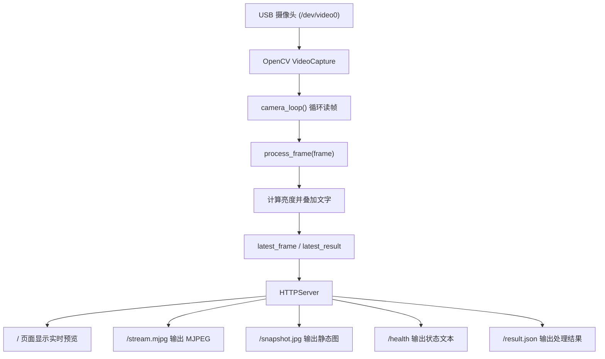

[原始报告](https://github.com/sysuwilliam/arduino-UNO-Q-4GB/blob/main/%E5%BC%80%E5%8F%91%E6%8A%A5%E5%91%8A/5.%E5%9C%A8Debian%E4%B8%BB%E6%9C%BA%E4%B8%8A%E9%83%A8%E7%BD%B2OpenCV%E6%91%84%E5%83%8F%E5%A4%B4%E6%9C%8D%E5%8A%A1.md)

# 在 Debian 主机上完成基于opencv的实时图像处理

本篇报告记录视觉应用方向的一次关键尝试：**不依赖 Arduino App Lab 的摄像头 Brick，而是直接在 UNO Q 的 Debian 主机系统中编写并运行 OpenCV 程序，完成 USB 摄像头采集、图像处理、浏览器预览和结果接口输出。**

这一阶段的工作重点，是把摄像头真正跑通，并建立一个后续可以继续扩展的 OpenCV 基础框架。

```text
UNO Q 进入 Debian 桌面
    -> 识别 USB 摄像头设备 /dev/video0
    -> 确认摄像头支持的分辨率和编码格式
    -> 在板端部署 debian-opencv 项目
    -> 使用 Python + OpenCV 直接打开摄像头
    -> 对视频帧做基础处理（亮度统计与文字叠加）
    -> 通过 HTTP 服务输出网页、MJPEG、快照和 JSON
    -> 在浏览器中验证实时画面与处理结果
```

---

## 一、为什么要做这一版 OpenCV 实验

Arduino UNO Q 的特色之一，是它既可以像传统 Arduino 一样运行 MCU 侧程序，也可以像一台小型 Linux 主机那样运行 Debian。在视觉类项目中，摄像头、图像解码、图像处理、网络预览、结果输出这些任务，更适合放在 Linux 主机侧完成。

我这次做的并不是直接使用官方“开箱即用”的 AI 检测例程，而是先从一个更基础、更可控的 OpenCV 服务入手，原因主要有三点：

1. 我要先验证 **UNO Q 板端 Debian 是否能稳定驱动 USB 摄像头并被 Python/OpenCV 直接访问**。
2. 我要建立一个**完全由自己掌控的图像处理入口**，便于后续逐步加入灰度化、边缘检测、轮廓分析、矩形检测等算法。
3. 我要把结果同时输出到**网页预览、静态快照和 JSON 接口**，这样以后无论是人看页面，还是程序调用结果，都有统一入口。

---

## 二、为什么选择在 Debian 写程序，而不是直接在 App Lab 写

这个问题其实是本次开发中最关键的技术选择。

从表面上看，Arduino App Lab 也能管理项目、运行示例，而且官方的 `detect-objects-on-camera` 项目确实能显示摄像头画面。那为什么这次没有直接照搬它，而是转向 Debian 主机侧自己写 OpenCV 程序？原因如下。

### 1. App Lab 的官方摄像头例程，本质上是“Brick 管理的视频管线”

根据我和 Codex 的对话记录，官方 `detect-objects-on-camera` 示例之所以能直接显示视频，不是因为普通 WebUI 自己完成了摄像头采集，而是因为它使用了：

- `arduino:video_object_detection` Brick
- Brick 提供的摄像头视频管线
- `/embed` 页面作为现成的视频显示入口

也就是说，那个项目更像是在**调用官方封装好的摄像头能力**，而不是从零开始自己控制摄像头。

这种方式适合快速跑通官方示例，但不适合我这一步想做的事情：**直接接管摄像头、手写 OpenCV 处理逻辑，并把处理后的图像由我自己的 Python 服务输出出来。**

### 2. Debian 主机可以直接访问 `/dev/video0`，更适合底层调试

在 Debian 下，我可以直接用：

```bash
ls -l /dev/video*
v4l2-ctl --device=/dev/video0 --list-formats-ext
```

确认摄像头设备节点、支持的编码格式、分辨率和帧率。这一步非常重要，因为视觉问题很多时候不是“算法错了”，而是：

- 摄像头根本没有被识别
- 打开了错误的 `/dev/videoX`
- 分辨率设置不合理
- 编码格式不兼容
- 帧率太高或太低

在 Debian 里这些问题都能被清晰地看见；而在 App Lab 的 Brick 模式下，很多底层细节已经被封装掉了，调试自由度会低一些。

### 3. OpenCV 更适合放在 Debian 主机侧单独运行

这次项目的核心是 `cv2.VideoCapture()`、`cv2.putText()`、`cv2.imencode()` 等 OpenCV 操作。它们本质上属于标准 Linux + Python + OpenCV 工作流，放在 Debian 主机上运行有几个直接优势：

- 可以完全按标准 Python 程序组织代码
- 可以自由使用系统级摄像头接口和 V4L2
- 可以自己决定 HTTP 服务结构
- 可以随时扩展为更多图像处理算法
- 便于通过终端日志观察程序运行状态

如果后面要继续做边缘检测、轮廓识别、几何分析、颜色分割或目标跟踪，Debian 主机侧都会更灵活。

### 4. App Lab 在这里更适合作为“项目管理入口”，而不是主要运行环境

我此次项目文件夹是放在 App Lab 的工程目录中进行管理的，但真正负责摄像头读取与图像处理的是 Debian 主机程序。

也就是说，这一阶段的关系更接近于：

```text
App Lab
    -> 负责项目目录管理与文件查看

Debian Python 程序
    -> 负责摄像头访问
    -> 负责 OpenCV 图像处理
    -> 负责 HTTP 预览输出
```


---

## 三、OpenCV 在本项目中的作用

OpenCV 是一个非常成熟的计算机视觉库。它不仅能读取摄像头图像，还能完成大量基础视觉任务，例如：

- 图像采集
- 颜色空间转换
- 图像缩放
- 绘制文字和图形
- 边缘检测
- 轮廓检测
- 几何形状分析
- 编码成 JPEG/PNG

在本次实验里，OpenCV 主要承担了四个任务：

1. **通过 `VideoCapture` 打开 USB 摄像头。**
2. **逐帧读取视频图像。**
3. **计算整帧平均亮度，并在图像上叠加识别结果文字。**
4. **把处理后的图像编码成 JPEG，供网页实时显示和快照输出。**

虽然当前这一版处理逻辑还比较基础，只做了亮度判断，但这个框架已经具备明显的扩展性。以后只需要继续修改 `process_frame(frame)`，就能逐步加入更复杂的视觉算法。

---

## 四、项目结构和总体逻辑

这次使用的项目目录是：

```text
/home/arduino/ArduinoApps/debian-opencv
```

核心文件非常精简：

| 文件 | 作用 |
|------|------|
| `main.py` | OpenCV 摄像头采集、图像处理、HTTP 服务主程序 |
| `run_host.sh` | 启动脚本，进入当前目录后执行 `python3 main.py` |
| `README.md` | 使用说明 |

整个项目的执行逻辑如下：



从框架上看，对其做了分工：

- 后台线程 `camera_loop()` 专门负责持续读取摄像头
- `process_frame()` 专门负责每帧图像处理
- HTTP 处理器 `Handler` 专门负责响应浏览器请求
- 共享变量 `latest_frame` 和 `latest_result` 负责在采集线程与网页服务之间传递最新结果

这种结构有两个优点：

1. **逻辑清晰。** 摄像头采集、图像处理、网页访问互不混淆。
2. **便于扩展。** 后续如果要加入更多结果字段、检测框、统计信息，都可以继续往 `process_frame()` 和 `result.json` 里加。

---

## 五、环境准备与摄像头检查

正式运行 OpenCV 程序前，我先做了一个非常重要的检查：确认系统是否已经识别 USB 摄像头，以及摄像头支持哪些输出格式。

首先查看系统中的视频设备：

```bash
ls -l /dev/video*
```

然后使用 `v4l2-ctl` 查看 `/dev/video0` 支持的格式与分辨率：

```bash
v4l2-ctl --device=/dev/video0 --list-formats-ext
```

检查结果如下图所示：


从图中可以看到：

- 系统识别出了多个 `/dev/videoX` 设备节点
- `/dev/video0` 的类型为 `Video Capture`
- 摄像头支持 `MJPG` 压缩格式
- 支持 `1920x1080`、`1280x720`、`640x480` 等多种分辨率
- `640x480` 支持 `30 fps`

后续我在 OpenCV 中选择 `640x480`、`MJPG`、`30 fps`就是根据这一步检查结果选出来的，确保程序参数与实际硬件能力一致。

---

## 六、把项目部署到开发板

我是在ubuntu主机上完成的项目代码编写。项目文件准备好后，需把压缩包传到开发板端，并解压到 `ArduinoApps` 目录下。部署时的终端操作如下：

```bash
cd /home/arduino/ArduinoApps
unzip debian-opencv.zip
ls -l
```

部署结果如下：


从这里可以确认两件事：

1. `debian-opencv.zip` 已经成功解压。
2. `opencv-detection` 或 `debian-opencv` 目录已经进入开发板的应用目录，后续可以直接在板端运行。


---

## 七、启动 OpenCV 服务

进入项目目录后，我先给启动脚本增加执行权限，然后直接启动：

```bash
cd /home/arduino/ArduinoApps/debian-opencv
chmod +x run_host.sh
./run_host.sh
```

启动界面如下：


程序启动后终端打印了两条非常关键的信息：

```text
OpenCV camera server: http://0.0.0.0:8080
camera opened
```

这说明：

1. HTTP 服务已经监听在 `8080` 端口。
2. OpenCV 成功打开了摄像头。

如果这里只看到服务启动而没有 `camera opened`，通常意味着摄像头没有正确打开；如果连服务地址都没有打印出来，那说明主程序本身就没有启动成功。现在两步都通过，说明框架已经进入可用状态。

---

## 八、在浏览器中访问预览页面

服务启动后，我用浏览器打开开发板 IP 对应的 `8080` 端口：

```text
http://10.233.80.145:8080
```

打开后的界面如下：


这个页面虽然很简洁，但已经包含了完整的调试入口：

- 主页面 `/`
- 实时视频流 `/stream.mjpg`
- 单帧快照 `/snapshot.jpg`
- 运行状态 `/health`
- 结果接口 `/result.json`

这正是我这次架构设计的一个重点：**不要只做一个“能看画面”的页面，而是同时把人看的页面和程序能调用的接口都建出来。**

---

## 九、当前这一版 OpenCV 做了什么处理

这一版还没有上更复杂的目标识别或几何识别算法，而是先做了一个最基础但很有代表性的处理：**计算图像平均亮度，并把判断结果叠加到画面上。**

核心逻辑是：

```text
读取一帧图像
    -> 计算 frame.mean()
    -> 判断亮度是否高于阈值 80.0
    -> 若高于阈值则标记为 BRIGHT
    -> 否则标记为 DARK
    -> 把文字绘制到图像左上角
```

处理完成后的预览效果如下：


图中可以看到，程序已经在实时视频上叠加了：

- `OpenCV BRIGHT`
- `brightness=153.3`

这说明 OpenCV 并不是只把摄像头原图搬到网页上，而是已经完成了：

1. 图像读取
2. 数值计算
3. 状态判断
4. 图像叠字
5. 编码并输出到网页

虽然识别内容还很简单，但这一步已经把“视觉处理闭环”完整跑通了。

---

## 十、日志验证与接口验证

实时预览页打开后，我又回到终端查看服务日志，确认浏览器请求是否真的到达了 Python 服务端。

日志如下图所示：


从日志可以看到浏览器发起了多种请求：

- `GET /`
- `GET /stream.mjpg`
- `GET /favicon.ico`

其中：

- `/` 返回 `200`
- `/stream.mjpg` 返回 `200`
- `/favicon.ico` 返回 `404`

这里的 `favicon.ico 404` 并不是程序错误，只是因为网页没有单独提供网站图标文件。真正重要的是首页和视频流都返回了 `200`，说明页面和视频预览链路完全正常。

此外，当前项目还提供了两个很实用的接口：

### 1. `/health`

返回纯文本状态，例如：

```text
streaming, brightness=153.3
```

适合快速确认程序是否还活着、摄像头是否持续读帧。

### 2. `/result.json`

返回结构化结果，例如：

```json
{
  "status": "streaming",
  "brightness": 153.3,
  "bright": true,
  "label": "bright"
}
```

后面如果我要把 OpenCV 结果交给别的程序、网页前端、机器人控制逻辑或 MCU 通信层使用，JSON 会比直接读图像方便得多。

---

## 十一、静态快照输出

除了实时流之外，我还测试了 `snapshot.jpg` 接口。点击页面中的 Snapshot 链接后，浏览器会直接打开最新一帧 JPEG 图像：


这个接口的价值在于：

- 便于快速保存某一帧结果
- 便于后续构建“拍照后识别”的模式
- 便于调试时固定某一帧进行分析

实时流适合看动态效果，静态快照适合保存和复查。两者配合后，调试体验会好很多。

---

## 十二、关键实现细节说明

为了后续扩展更复杂的视觉算法，这一版代码里有几个实现细节需要说明。

### 1. 使用 `cv2.CAP_V4L2`

程序中打开摄像头时使用了：

```python
cv2.VideoCapture(CAMERA_INDEX, cv2.CAP_V4L2)
```

这里显式指定 V4L2 后端，是因为在 Debian/Linux 上，USB 摄像头通常就是走 V4L2 视频设备接口。这样写可以减少 OpenCV 自动选择后端时带来的不确定性。

### 2. 显式设置 `MJPG`

程序里有：

```python
cap.set(cv2.CAP_PROP_FOURCC, cv2.VideoWriter_fourcc(*"MJPG"))
```

这是和前面的 `v4l2-ctl` 检查结果相对应的。因为摄像头明确支持 `MJPG`，所以直接让 OpenCV 按这个格式取流，通常会更稳定，也更符合摄像头硬件默认能力。

### 3. 把采集线程和 HTTP 服务分开

如果把“读帧”和“响应网页”写在一个同步循环里，网页一旦卡顿，就可能影响摄像头读取；摄像头读取变慢，也会影响页面刷新。

因此这里采用：

- `camera_loop()` 后台线程持续读帧
- `ThreadingHTTPServer` 专门响应访问

这样浏览器端和摄像头端解耦，整体会更稳定。

### 4. 保留 `latest_frame` 和 `latest_result`

程序每次读到新帧，不会立即只给一个客户端，而是先保存为“最新结果”：

- `latest_frame`
- `latest_result`

这样任何时刻只要有浏览器请求：

- `/stream.mjpg`
- `/snapshot.jpg`
- `/result.json`

都能拿到当前最新结果。这个思路很像一个轻量级共享内存缓存，适合实时视觉服务。

---

## 十三、本项目这一阶段的框架价值

这次工作完成后，UNO Q 上的 OpenCV 开发已经形成了一个可持续扩展的板端视觉框架。

它的价值不只是“看到了摄像头画面”，而是已经建立了以下能力：

| 能力 | 状态 |
|------|------|
| Debian 主机可直接访问 USB 摄像头 | 已验证 |
| OpenCV 可稳定读取视频帧 | 已验证 |
| 图像可进行基础处理和叠字 | 已验证 |
| 浏览器可实时查看处理结果 | 已验证 |
| 可导出静态快照 | 已验证 |
| 可输出 JSON 结构化结果 | 已验证 |
| 后续替换为更复杂算法 | 已具备基础 |

从项目演进角度看，现在已经完成了“平台层”工作。之后不管做什么识别任务，都可以沿着同一个入口继续往下加。

---

## 十四、完整源码

下面附上本阶段使用到的全部核心源码。

### 1. `main.py`

```python
import json
import threading
import time
from http import HTTPStatus
from http.server import BaseHTTPRequestHandler, ThreadingHTTPServer

import cv2


HOST = "0.0.0.0"
PORT = 8080

CAMERA_INDEX = 0
WIDTH = 640
HEIGHT = 480
FPS = 30
JPEG_QUALITY = 80

latest_frame = None
latest_status = "starting"
latest_brightness = 0.0
latest_result = {
    "status": latest_status,
    "brightness": latest_brightness,
    "bright": False,
}
lock = threading.Lock()


def process_frame(frame):
    """Apply basic OpenCV processing and return the processed frame plus result data."""
    brightness = float(frame.mean())
    bright = brightness >= 80.0

    label = "BRIGHT" if bright else "DARK"
    color = (0, 255, 0) if bright else (0, 165, 255)

    cv2.putText(
        frame,
        f"OpenCV {label} brightness={brightness:.1f}",
        (20, 40),
        cv2.FONT_HERSHEY_SIMPLEX,
        1.0,
        color,
        2,
        cv2.LINE_AA,
    )

    result = {
        "status": "streaming",
        "brightness": round(brightness, 1),
        "bright": bright,
        "label": label.lower(),
    }
    return frame, result


def camera_loop():
    global latest_frame, latest_status, latest_brightness, latest_result

    cap = cv2.VideoCapture(CAMERA_INDEX, cv2.CAP_V4L2)
    cap.set(cv2.CAP_PROP_FOURCC, cv2.VideoWriter_fourcc(*"MJPG"))
    cap.set(cv2.CAP_PROP_FRAME_WIDTH, WIDTH)
    cap.set(cv2.CAP_PROP_FRAME_HEIGHT, HEIGHT)
    cap.set(cv2.CAP_PROP_FPS, FPS)

    if not cap.isOpened():
        with lock:
            latest_status = "cannot open camera"
            latest_result = {
                "status": latest_status,
                "brightness": latest_brightness,
                "bright": False,
                "label": "error",
            }
        print("cannot open camera")
        return

    print("camera opened")

    while True:
        ok, frame = cap.read()
        if not ok or frame is None:
            with lock:
                latest_status = "failed to read frame"
                latest_result = {
                    "status": latest_status,
                    "brightness": latest_brightness,
                    "bright": False,
                    "label": "error",
                }
            time.sleep(0.2)
            continue

        frame, result = process_frame(frame)

        with lock:
            latest_frame = frame
            latest_status = result["status"]
            latest_brightness = result["brightness"]
            latest_result = result

        time.sleep(1 / FPS)


class Handler(BaseHTTPRequestHandler):
    def do_GET(self):
        if self.path in ("/", "/index.html"):
            self.send_index()
        elif self.path == "/stream.mjpg":
            self.send_stream()
        elif self.path == "/snapshot.jpg":
            self.send_snapshot()
        elif self.path == "/health":
            self.send_health()
        elif self.path == "/result.json":
            self.send_result_json()
        else:
            self.send_error(HTTPStatus.NOT_FOUND, "not found")

    def get_jpeg(self):
        with lock:
            frame = None if latest_frame is None else latest_frame.copy()

        if frame is None:
            return None

        ok, encoded = cv2.imencode(
            ".jpg",
            frame,
            [int(cv2.IMWRITE_JPEG_QUALITY), JPEG_QUALITY],
        )
        if not ok:
            return None

        return encoded.tobytes()

    def send_index(self):
        html = """<!doctype html>
<html>
<head>
  <meta charset="utf-8">
  <title>OpenCV Camera</title>
  <style>
    body {
      margin: 0;
      min-height: 100vh;
      display: grid;
      place-items: center;
      background: #f4f7fb;
      font-family: Arial, sans-serif;
      color: #1f2933;
    }
    main {
      width: min(960px, calc(100vw - 32px));
      display: grid;
      gap: 14px;
    }
    header {
      display: flex;
      justify-content: space-between;
      align-items: end;
      gap: 16px;
    }
    h1 {
      margin: 0;
      font-size: 28px;
    }
    .viewer {
      aspect-ratio: 4 / 3;
      background: #111827;
      border: 1px solid #d9e2ec;
      border-radius: 8px;
      overflow: hidden;
      display: grid;
      place-items: center;
    }
    img {
      width: 100%;
      height: 100%;
      object-fit: contain;
    }
    .meta {
      display: flex;
      gap: 12px;
      flex-wrap: wrap;
      color: #52606d;
      font-size: 14px;
    }
  </style>
</head>
<body>
  <main>
    <header>
      <div>
        <h1>OpenCV Camera</h1>
        <div class="meta">Host Debian OpenCV stream</div>
      </div>
      <a href="/snapshot.jpg" target="_blank">Snapshot</a>
    </header>
    <section class="viewer">
      
    </section>
    <div class="meta">
      <a href="/health" target="_blank">Health</a>
      <a href="/result.json" target="_blank">Result JSON</a>
    </div>
  </main>
</body>
</html>
"""
        data = html.encode("utf-8")
        self.send_response(HTTPStatus.OK)
        self.send_header("Content-Type", "text/html; charset=utf-8")
        self.send_header("Content-Length", str(len(data)))
        self.send_header("Cache-Control", "no-store")
        self.end_headers()
        self.wfile.write(data)

    def send_snapshot(self):
        jpeg = self.get_jpeg()
        if jpeg is None:
            self.send_error(HTTPStatus.SERVICE_UNAVAILABLE, "no frame")
            return

        self.send_response(HTTPStatus.OK)
        self.send_header("Content-Type", "image/jpeg")
        self.send_header("Content-Length", str(len(jpeg)))
        self.send_header("Cache-Control", "no-store")
        self.end_headers()
        self.wfile.write(jpeg)

    def send_stream(self):
        self.send_response(HTTPStatus.OK)
        self.send_header("Age", "0")
        self.send_header("Cache-Control", "no-cache, private")
        self.send_header("Pragma", "no-cache")
        self.send_header("Content-Type", "multipart/x-mixed-replace; boundary=frame")
        self.end_headers()

        while True:
            jpeg = self.get_jpeg()
            if jpeg is None:
                time.sleep(0.1)
                continue

            try:
                self.wfile.write(b"--frame\r\n")
                self.wfile.write(b"Content-Type: image/jpeg\r\n")
                self.wfile.write(f"Content-Length: {len(jpeg)}\r\n\r\n".encode("ascii"))
                self.wfile.write(jpeg)
                self.wfile.write(b"\r\n")
            except (BrokenPipeError, ConnectionResetError):
                break

            time.sleep(1 / FPS)

    def send_health(self):
        with lock:
            text = f"{latest_status}, brightness={latest_brightness:.1f}\n"

        data = text.encode("utf-8")
        self.send_response(HTTPStatus.OK)
        self.send_header("Content-Type", "text/plain; charset=utf-8")
        self.send_header("Content-Length", str(len(data)))
        self.send_header("Cache-Control", "no-store")
        self.end_headers()
        self.wfile.write(data)

    def send_result_json(self):
        with lock:
            payload = json.dumps(latest_result).encode("utf-8")

        self.send_response(HTTPStatus.OK)
        self.send_header("Content-Type", "application/json; charset=utf-8")
        self.send_header("Content-Length", str(len(payload)))
        self.send_header("Cache-Control", "no-store")
        self.end_headers()
        self.wfile.write(payload)


threading.Thread(target=camera_loop, daemon=True).start()

server = ThreadingHTTPServer((HOST, PORT), Handler)
print(f"OpenCV camera server: http://0.0.0.0:{PORT}")
server.serve_forever()
```

### 2. `run_host.sh`

```bash
#!/usr/bin/env bash
set -euo pipefail

cd "$(dirname "$0")"
python3 main.py
```

### 3. `README.md`

````md
# Debian OpenCV

Basic host-Debian OpenCV camera service for Arduino UNO Q.

This project runs directly on the UNO Q Debian host, not inside an App Lab
container. It opens the USB camera with OpenCV and serves a browser preview on
port `8080`.

## Run

```bash
cd "/home/arduino/ArduinoApps/debian-opencv"
./run_host.sh
```

Open:

```text
http://<board-ip>:8080
```

Example:

```text
http://10.233.80.145:8080
```

## Endpoints

- `/` - Web preview page.
- `/stream.mjpg` - MJPEG video stream.
- `/snapshot.jpg` - Single JPEG frame.
- `/health` - Plain text status.
- `/result.json` - Latest OpenCV result.

Example `/result.json`:

```json
{
  "status": "streaming",
  "brightness": 92.4,
  "bright": true,
  "label": "bright"
}
```

## Add Processing

Edit `process_frame(frame)` in `main.py`.

The function returns:

```python
return frame, result
```

- `frame` is the processed image to display.
- `result` is the JSON object served at `/result.json`.

## Background Run

```bash
cd "/home/arduino/ArduinoApps/debian-opencv"
nohup ./run_host.sh > opencv.log 2>&1 &
```

Stop:

```bash
pkill -f "/home/arduino/ArduinoApps/debian-opencv/main.py"
```
````

---

## 十五、总结

这次 OpenCV 开发的意义，不只是“在 UNO Q 上打开了摄像头”，而是验证了一条视觉开发路线：

```text
UNO Q SBC 模式
    -> Debian 主机直接访问 USB 摄像头
    -> Python + OpenCV 负责图像处理
    -> HTTP 页面负责结果展示
    -> JSON 接口负责结构化输出
    -> 后续继续叠加更复杂的识别算法
```

从结果看，这条路线是成功的，而且比直接在 App Lab 中堆功能更适合作为 OpenCV 视觉实验的起点。因为 Debian 提供了对摄像头、Python、V4L2、OpenCV 和终端调试的完全控制权；而 App Lab 在这一阶段更适合做项目入口和辅助管理。

因此，本篇工作可以看作是后续矩形检测、目标检测和更复杂视觉任务的“地基”。地基一旦打稳，后面的算法扩展才会真正高效。

---

## 参考文档

| 内容 | 链接 |
|------|------|
| Arduino UNO Q 用户手册 | [Arduino UNO Q User Manual](https://docs.arduino.cc/tutorials/uno-q/user-manual/) |
| Arduino App Lab 文档 | [Arduino App Lab](https://docs.arduino.cc/software/app-lab/) |
| App Lab Linux 安装说明 | [Setup Arduino App Lab on Linux](https://docs.arduino.cc/software/app-lab/setup/linux/) |
| UNO Q SSH 连接说明 | [Connect to UNO Q via Secure Shell](https://docs.arduino.cc/tutorials/uno-q/ssh/) |
| OpenCV Python 文档 | [OpenCV-Python Tutorials](https://docs.opencv.org/4.x/d6/d00/tutorial_py_root.html) |
