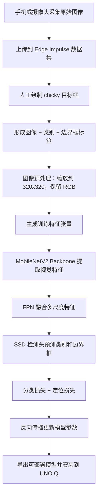
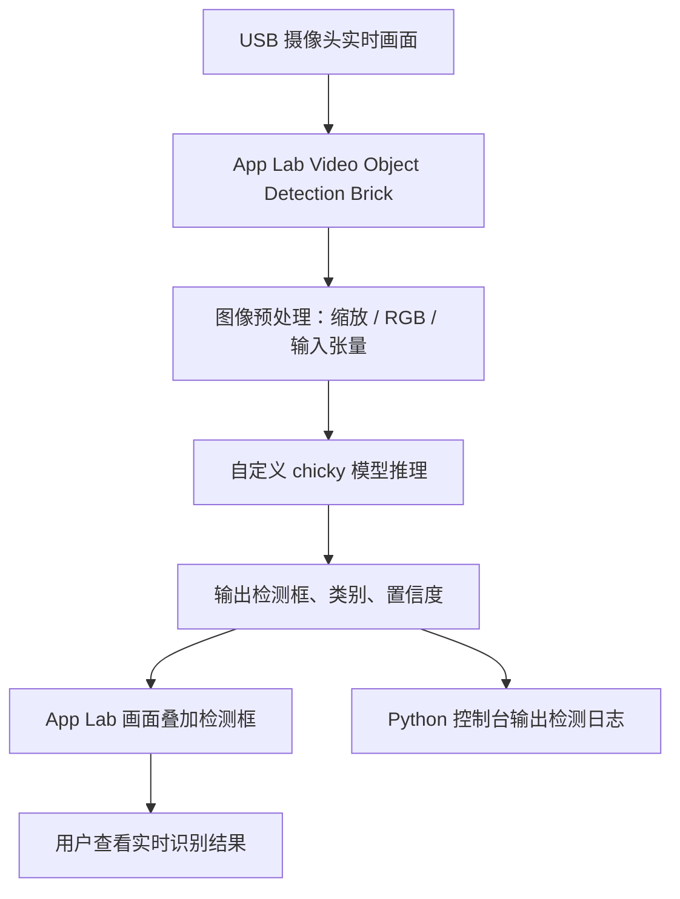

[原始报告](https://github.com/sysuwilliam/arduino-UNO-Q-4GB/blob/main/%E5%BC%80%E5%8F%91%E6%8A%A5%E5%91%8A/7.%E8%87%AA%E5%AE%9A%E4%B9%89AI%E8%AF%86%E5%88%AB%E6%A8%A1%E5%9E%8B%E8%AE%AD%E7%BB%83%E4%B8%8E%E9%83%A8%E7%BD%B2.md)

# 自定义AI识别模型训练与部署

本篇报告记录我如何基于 Arduino App Lab 和 Edge Impulse 完成一个“小白鸡”视觉识别项目。项目目标并不是简单运行官方预置模型，而是从自己的数据集开始，完成图像采集、目标框标注、模型训练、参数调节、模型测试，并最终把训练好的模型部署回 Arduino UNO Q 开发板，在实时摄像头画面中识别小白鸡目标。

这一阶段的核心链路可以概括为：

```text
Arduino App Lab 打开视觉识别应用
    -> 在 Video Object Detection Brick 中进入 AI models
    -> 通过 Train new AI model 跳转到 Edge Impulse Studio
    -> 新建 chicky 项目并选择 Arduino UNO Q 作为目标设备
    -> 采集小白鸡图像数据
    -> 为每张图片绘制目标检测框并标注 chicky
    -> 设计 Impulse：Image 预处理 + Object Detection 学习块
    -> 选择 MobileNetV2 SSD FPN-Lite 320x320 模型
    -> 调整训练轮次、学习率、验证集比例、Batch size 等参数
    -> 训练并观察分类损失、定位损失和总损失
    -> 使用验证集与测试集评估模型
    -> 回到 App Lab 安装模型到 UNO Q
    -> 运行应用并在摄像头画面中看到小白鸡检测框和置信度
```

从项目性质上看，这次工作更接近一个完整的边缘 AI 小闭环：不是在电脑上训练完就结束，而是要让模型真正进入开发板端应用，处理实时图像，并输出可视化识别结果。

---

## 一、本次开发目标

本项目的目标可以分成三层：

| 层级 | 目标 |
|------|------|
| 数据层 | 采集小白鸡在不同角度、距离和背景下的图像，并把目标区域标注为 `chicky` |
| 模型层 | 在 Edge Impulse 中构建目标检测 Impulse，训练一个能输出检测框和置信度的模型 |
| 部署层 | 将模型安装到 Arduino UNO Q 的 App Lab 应用中，通过摄像头进行实时识别 |

和前几次 OpenCV 实验不同，这次使用的是机器学习模型。OpenCV 矩形检测依靠人工写出的边缘、轮廓、面积、角点等规则，而本次 AI 识别依靠样本数据训练出模型参数。也就是说，我不再直接告诉程序“什么形状才是小白鸡”，而是给它大量标注好的例子，让神经网络从这些例子里学习小白鸡的视觉特征。

---

## 二、从 App Lab 进入自定义 AI 模型训练

项目的入口仍然在 Arduino App Lab 中。我打开自己的 `chicky detection` 应用后，进入 `Video Object Detection` Brick 的 `AI models` 页面。这里既能看到已有模型，也能通过 `Train new AI model` 创建自己的模型训练流程。


这一页非常关键，因为它把 App Lab 和 Edge Impulse 连接起来。根据 Arduino 官方 App Lab AI Models 文档，自定义模型的大体路线就是：在 App Lab 的 AI Brick 中发起训练请求，然后进入 Edge Impulse Studio 完成数据、训练和部署，最后再回到 App Lab 使用训练好的模型。

点击训练入口后，浏览器进入 Edge Impulse 的项目页面。这里使用的是 Arduino 账号体系联动 Edge Impulse，因此不需要从零单独配置一套完全割裂的机器学习环境。


随后我创建新的 Edge Impulse 项目。项目类型选择 `Personal`，可见性选择 `Private`，这样可以保证当前训练数据和模型只作为个人实验项目使用。


项目创建完成后，Edge Impulse 自动进入名为 `chicky` 的项目首页。


在正式采集和训练前，需要先配置目标设备。这里选择 `Arduino UNO Q (Qualcomm QRB2210)`，这样 Edge Impulse 后续会按照 UNO Q 的处理器、内存和部署环境估算模型性能，并生成适合板端运行的模型。


这一步看起来只是一个下拉框选择，但对边缘 AI 项目非常重要。模型不是只要准确率高就可以，最终还必须在开发板上跑得动。选择目标设备后，Edge Impulse 会在模型训练和部署时关注模型大小、RAM 占用、推理时间等指标。

---

## 三、数据采集与目标标注

AI 模型训练的质量很大程度上取决于数据。官方文档也明确把 Data Acquisition 放在工作流最前面，因为模型学到的不是我口头描述的“小白鸡”，而是训练集中那些图像和标签之间的对应关系。

在 Edge Impulse 的数据采集页面中，可以选择多种方式上传数据，包括手机扫码采集、从电脑上传文件，或者连接开发板设备采集。


我这里使用手机作为采集设备。手机连接成功后，Edge Impulse 会把手机当成一个临时数据源，用摄像头拍摄图片并上传到项目数据集中。


由于本项目要在画面中框出小白鸡的位置，而不是只判断整张图片是否包含小白鸡，所以我选择的是目标检测项目。Edge Impulse 会询问是否正在构建 object detection project，这里选择 `Yes`。


目标检测和图像分类的根本区别在于输出不同：

| 类型 | 输入 | 输出 |
|------|------|------|
| 图像分类 | 一张图片 | 图片属于哪个类别 |
| 目标检测 | 一张图片 | 目标类别、目标框位置、置信度 |

如果只是做“这一帧里有没有小白鸡”，图像分类就够了。但本项目最终要在画面中显示检测框，所以必须标注目标框，让模型同时学习“是什么”和“在哪里”。

开始采集后，数据集中先出现少量样本。可以看到画面中白色小鸡玩具已经作为项目对象进入数据集。


继续采集后，数据数量逐步增加。为了让模型不要只记住一种背景或一种角度，我在采集时让小白鸡出现在不同位置、不同距离和不同背景中，例如桌面、键盘、鼠标垫附近等。


采集完成后，下一步是标注。目标检测数据并不是只写一个类别名，还要在每张图上框出目标所在区域。下图中可以看到左侧是样本列表，右侧是当前样本图像预览。


在单张图像中，我用矩形框包住小白鸡主体，并把这个框标注为 `chicky`。


这里的标注框是训练目标检测模型的“标准答案”。对每张图像来说，模型训练时看到的是：

```text
输入：原始图像像素
标签：类别 chicky + 目标框位置 (x, y, width, height)
```

训练时模型会先预测一组候选框和类别概率，再把预测结果与人工标注框比较。如果类别预测错了，分类损失会上升；如果框的位置偏了，定位损失会上升。后面训练曲线里的 `classification_loss` 和 `localization_loss` 就是这样来的。

完成标注后，样本列表中可以看到当前图片已经带上 `chicky` 标签。


最终数据集共采集了 180 张图片，并按照 83% / 17% 划分为训练集和测试集：训练集 149 张，测试集 31 张。


这个划分很重要。训练集用于更新模型参数，测试集不参与训练，只在训练完成后用来检验模型是否真的学会了泛化，而不是只记住训练图片。

---

## 四、训练数据从底层如何进入模型

这次项目虽然是在 Edge Impulse 的图形界面中完成，但底层仍然遵循标准目标检测训练流程。可以把它拆成下面几步：



从像素角度看，模型并不知道“小白鸡”这个词是什么意思。它接收到的是一张 RGB 图片，也就是每个像素有红、绿、蓝三个通道。后面设置的 320x320 输入尺寸意味着单张图像进入网络前会被转换为：

```text
320 x 320 x 3 = 307,200 个输入数值
```

这些数值经过卷积神经网络后，会逐层变成边缘、纹理、局部形状和更高层的目标特征。目标检测模型最后输出的不是一个简单类别，而是一组候选检测结果：

```text
[
  class = chicky,
  confidence = 0.xx,
  box = (x, y, width, height)
]
```

训练过程就是不断调整网络内部权重，让预测框越来越接近人工标注框，让 `chicky` 的置信度越来越接近真实标签。

---

## 五、设计 Impulse：图像输入、预处理与目标检测输出

数据准备完成后，进入 `Impulse design` 阶段。Impulse 可以理解为 Edge Impulse 中的模型流水线，它定义了数据如何进入模型、如何预处理、用什么学习块训练，以及最后输出什么结果。


这一步我设置的关键参数如下：

| 参数 | 本项目设置 | 作用 |
|------|------------|------|
| Input axes | `image` | 输入为图像数据 |
| Image width | `320` | 统一输入宽度 |
| Image height | `320` | 统一输入高度 |
| Resize mode | `Fit shortest` | 尽量保持目标比例，避免强行拉伸小白鸡外形 |
| Processing block | `Image` | 对图像做统一预处理 |
| Learning block | `Object Detection (Images)` | 训练目标检测模型 |
| Output features | `1 (chicky)` | 输出类别只有小白鸡 |

选择 320x320 是因为后面使用的 MobileNetV2 SSD FPN-Lite 模型只支持 320x320 输入。尺寸越大，目标细节越多，但计算量和内存也会上升；尺寸越小，推理更快，但小目标可能丢失细节。小白鸡在画面中通常占据中等大小区域，因此 320x320 是一个比较合适的折中。

保存 Impulse 后，进入图像预处理参数页面。这里的颜色深度选择 `RGB`。


RGB 保留了颜色信息。虽然小白鸡主体偏白，看起来颜色特征并不复杂，但背景中有桌面、键盘、鼠标垫等不同颜色，RGB 输入可以让模型更好地区分目标和环境。若改成灰度，计算量可能降低，但也会丢失一部分有用的颜色线索。

保存参数后，开始生成特征。


特征生成完成后，Edge Impulse 显示一共创建了 149 个窗口，对应训练集中的 149 个目标样本。右侧的特征可视化图可以帮助观察样本在特征空间中的分布。


图中还能看到预处理阶段的设备性能估算：处理时间约 1 ms，峰值 RAM 使用约 4 KB。这里评估的是图像预处理块本身，不代表完整神经网络的推理时间，但它说明前置处理对 UNO Q 来说压力很小。

---

## 六、选择模型结构与训练参数调节

在学习块中，我选择了 `MobileNetV2 SSD FPN-Lite (320x320 only)` 作为目标检测模型。


这个模型结构可以拆成三部分理解：

| 组件 | 作用 |
|------|------|
| MobileNetV2 | 轻量级卷积网络，负责从图像中提取视觉特征 |
| FPN-Lite | 融合不同尺度的特征，让模型既能看局部细节，也能看整体形状 |
| SSD 检测头 | 在特征图上预测目标类别和边界框位置 |

选择它的原因是：本项目目标数量少、类别单一，但需要比较准确地画出目标框。FOMO 这类模型更轻量，但更偏向粗粒度位置检测；MobileNetV2 SSD FPN-Lite 更适合输出标准 bounding box，因此更符合“小白鸡实时框选识别”的目标。

随后配置训练参数。


本次训练使用的主要参数如下：

| 参数 | 设置 | 调节意义 |
|------|------|----------|
| Training processor | `CPU` | 使用云端 CPU 训练，适合当前数据规模 |
| Number of training cycles | `50` | 训练 50 轮，让模型有足够次数学习样本 |
| Learning rate | `0.10` | 控制每次参数更新步长 |
| Data augmentation | 未开启 | 先建立稳定基线，避免增强策略引入额外变量 |
| Validation set size | `20%` | 从训练集中划出一部分做训练过程验证 |
| Profile int8 model | 开启 | 评估量化模型，便于后续部署 |
| Batch size | `32` | 每次训练读取 32 张样本，兼顾速度和稳定性 |

这些参数不是孤立的。训练轮次决定模型看多少遍数据；学习率决定每次参数更新幅度；验证集比例决定训练过程中有多少样本用于检查泛化能力；Batch size 影响训练噪声、速度和内存占用。

如果训练轮次太少，损失还没降下来就停止，模型会欠拟合；如果训练轮次太多，而数据集又比较单一，模型可能记住背景细节，导致过拟合。50 轮的选择结合了后面损失曲线：模型在前几轮快速下降，后续趋于稳定，说明这个轮次足以收敛。

学习率为 0.10 时需要重点观察损失曲线。如果曲线持续震荡或者后期不稳定，就应该降低学习率，例如改为 0.01 或更小。当前曲线整体下降比较顺畅，因此本次训练没有继续下调。

点击训练后，Edge Impulse 开始输出训练日志。


训练完成后，验证集结果显示 `MAP@50` 达到 0.98。


这里的 `MAP@50` 可以理解为：当预测框和人工标注框的重合程度达到 IoU 0.50 时，模型检测结果的平均精度。0.98 说明在验证集上，小白鸡目标大多数情况下都能被正确检测到，并且框的位置也比较接近人工标注。

继续查看量化模型和设备相关指标，可以看到 int8 模型版本、输入层和输出层结构，以及板端资源估算。


int8 量化的意义在于把模型权重和中间计算从浮点数压缩到 8 位整数表示。这样通常可以减少模型大小和内存占用，提高边缘设备上的推理效率。代价是精度可能略有下降，因此量化后仍然需要看验证指标和实际运行效果。

---

## 七、从损失曲线判断模型是否训练稳定

训练完成后，我重点查看了三条损失曲线：分类损失、定位损失和总损失。


`classification_loss` 关注模型是否把目标判断为正确类别。因为本项目只有一个类别 `chicky`，分类任务相对简单，曲线在前几轮快速下降，说明模型很快学会了小白鸡的类别特征。


`localization_loss` 关注预测框与人工标注框之间的位置差异。目标检测的难点往往在这里：模型不仅要知道“小白鸡在图中”，还要把框画准。从曲线看，定位损失也在前期迅速下降，后期保持较低水平，说明 bounding box 学习比较稳定。


`total_loss` 是综合损失，通常由分类损失和定位损失共同构成。三条曲线都在较早阶段收敛，并且训练集与验证集走势接近，说明这次训练没有出现明显的欠拟合或严重过拟合。

不过，损失曲线只能说明训练过程是否稳定，不能单独证明模型在真实环境中一定可靠。因此还需要使用独立测试集评估。

---

## 八、模型测试与指标解释

训练结束后，我进入 `Model testing` 页面，对测试集进行推理。


测试作业完成后，测试集上的 `MAP@50` 达到 1.00。


测试集结果非常理想，表明在这 31 张未参与训练的测试图片中，模型能够稳定识别 `chicky`。页面中还可以看到单张样本的检测精度，例如 89%、100% 等，说明不同图片的置信度会随角度、背景和目标大小略有波动。

这里需要注意两个概念：

| 指标 | 含义 |
|------|------|
| `mAP` | 多个 IoU 阈值下综合平均精度，更严格 |
| `MAP@50` | 只要求预测框与真实框 IoU 达到 0.50，相对宽松 |

本项目测试集 `MAP@50 = 1.00`，说明模型已经能稳定找到目标；但真实部署时仍然不能只看这个数字。因为测试集规模为 31 张，且采集环境和训练环境相近，后续如果要让模型在更多光照、背景、遮挡和距离下稳定工作，还需要继续扩充数据。

最后查看测试集特征分布。虽然只有一个类别，但不同样本仍然会因为拍摄角度、背景和距离不同，在特征空间中形成一定分布。


如果未来加入“不是小白鸡”的负样本，或者加入其他物体类别，这个特征空间会更有意义，可以用来观察不同类别之间是否分得开。

---

## 九、部署回 App Lab 并安装到开发板

模型训练和测试完成后，回到 Arduino App Lab。此时 `Video Object Detection` Brick 的 AI models 页面中已经可以看到新训练出的 `chicky` 模型。点击安装后，App Lab 开始把模型构建并安装到 Arduino UNO Q。


安装完成后，模型状态变为 `Installed`，并且可以在 Brick 配置中被选中。


这一步实际上完成了从云端训练到板端部署的关键转换。按照官方说明，Edge Impulse 为 UNO Q 导出的模型会以 `.eim` 等可部署形式提供，App Lab 则负责把模型接入对应的 AI Brick。部署后的运行链路可以理解为：



也就是说，Edge Impulse 负责训练出模型，App Lab 负责把模型放进实时视频识别 Brick，Arduino UNO Q 负责在本地执行推理和展示结果。这样，识别任务不再依赖电脑端手动判断，而是在开发板应用内形成实时闭环。

---

## 十、实际识别效果

部署完成后运行 App，可以在摄像头画面中看到模型已经识别出小白鸡，并画出红色检测框。第一张效果图中，模型输出 `chicky (0.91)`。


第二张图中，小白鸡被旋转到不同角度，模型仍然识别为 `chicky (0.92)`。


第三张图中，小白鸡位于较暗背景和鼠标垫附近，模型输出 `chicky (0.89)`，置信度略低但仍然识别正确。


从这三张结果可以看出，模型不仅能在训练界面中取得较高指标，也能在 App Lab 的实时视频画面中输出可用的检测框。置信度在 0.89 到 0.92 之间波动，说明模型对目标有较稳定判断，但不同背景和角度仍会影响置信度。

---

## 十一、训练参数调节经验

这次训练中最值得总结的是参数调节思路，而不是单纯记住某个数值。

### 1. 数据量与数据多样性优先于复杂模型

本项目只有一个类别，模型结构并不需要非常复杂。真正影响效果的是数据是否覆盖实际运行场景。180 张图像对于入门项目已经能跑出可见效果，但如果后续要在更多环境下稳定识别，应继续补充：

- 更强和更弱的光照
- 更远距离的小目标
- 更复杂背景
- 部分遮挡
- 不同角度和朝向
- 没有小白鸡的负样本

### 2. 标注框要稳定，不能忽大忽小

目标检测模型直接学习人工框的位置。如果有些图片框得很紧，有些图片框得很松，模型会学到不一致的边界标准，最终检测框也会不稳定。因此标注时尽量贴合小白鸡主体，并保持同一套标注习惯。

### 3. 输入尺寸要和模型匹配

MobileNetV2 SSD FPN-Lite 要求 320x320 输入，因此 Impulse 中也必须设置为 320x320。如果输入尺寸和模型结构不匹配，后续训练或部署就会出现问题。

### 4. 训练轮次要结合损失曲线判断

50 轮不是越多越好，而是结合曲线后得到的结果。当前三条损失曲线在前几轮下降明显，后期比较平稳，说明训练已经收敛。如果未来加入更多复杂数据，可以适当增加训练轮次，但要继续观察验证集损失是否开始反弹。

### 5. 学习率要看是否稳定下降

当前学习率为 0.10，曲线整体可控。如果后续训练出现剧烈震荡、损失不降或者精度异常，就应该优先尝试降低学习率。学习率本质上控制模型参数每次“走多远”，太大会跳过最优点，太小会训练很慢。

### 6. 验证集和测试集不能混用

验证集用于训练过程中的模型选择和调参，测试集用于最终检查。当前数据集中训练集 149 张、测试集 31 张，另外训练参数中又设置了 20% 验证集。这样做的好处是既能观察训练过程，也能保留独立数据做最终评估。

### 7. 量化要结合真实部署验证

int8 量化可以降低模型占用、提升边缘部署效率，但可能带来精度损失。当前量化模型在验证结果中表现良好，最终部署到 App Lab 后也能实时识别。后续如果发现板端识别明显不如训练页面，应重新比较 float32 与 int8 模型表现。

---

## 十二、本项目的整体架构理解

从系统架构上看，本项目由三部分构成：

| 模块 | 作用 |
|------|------|
| Arduino App Lab | 管理应用、调用 Video Object Detection Brick、安装和运行模型 |
| Edge Impulse Studio | 采集数据、标注目标框、设计 Impulse、训练和评估模型 |
| Arduino UNO Q | 作为最终边缘设备，运行摄像头识别应用并输出实时结果 |

更完整的架构可以概括为：

```text
开发者
    -> 在 App Lab 中创建视觉应用
    -> 通过 AI models 入口连接 Edge Impulse

Edge Impulse
    -> 管理数据集
    -> 保存 chicky 标注框
    -> 执行图像预处理
    -> 训练 MobileNetV2 SSD FPN-Lite
    -> 输出模型指标和可部署模型

Arduino App Lab
    -> 识别可用自定义模型
    -> 安装模型到 UNO Q
    -> 将模型绑定到 Video Object Detection Brick

Arduino UNO Q
    -> 接收摄像头帧
    -> 执行模型推理
    -> 显示检测框与置信度
```

这也是 Arduino App Lab 与 Edge Impulse 集成的价值所在：机器学习中最麻烦的模型训练、导出和部署过程被串成了一个统一流程。对于小型边缘 AI 项目来说，可以把精力更多放在数据质量、参数调节和实际效果验证上。

---

## 十三、总结

本次小白鸡 AI 识别项目完成了从数据到部署的完整闭环。通过 Arduino App Lab，我从视觉识别 Brick 进入自定义模型训练；通过 Edge Impulse，我采集并标注了 180 张小白鸡图片，设计了 320x320 RGB 图像输入和目标检测学习块，使用 MobileNetV2 SSD FPN-Lite 训练模型，并通过损失曲线、验证集和测试集检查模型质量；最后回到 App Lab，把模型安装到 Arduino UNO Q，并在实时画面中成功识别小白鸡。

本次结果中，验证集 `MAP@50` 达到 0.98，测试集 `MAP@50` 达到 1.00，实际运行时检测置信度约为 0.89 到 0.92。对于一个单类别入门目标检测项目来说，这已经说明流程和模型都跑通了。

---

## 参考资料

- [Custom AI Models for Arduino App Lab](https://docs.arduino.cc/software/app-lab/integrations/ai-models/)
- [Setup Arduino App Lab](https://docs.arduino.cc/software/app-lab/setup/overview/)
- [Train and deploy your own AI models in Arduino App Lab, now integrated with Edge Impulse](https://blog.arduino.cc/2026/03/04/train-and-deploy-your-own-ai-models-in-arduino-app-lab-now-fully-integrated-with-edge-impulse/)
